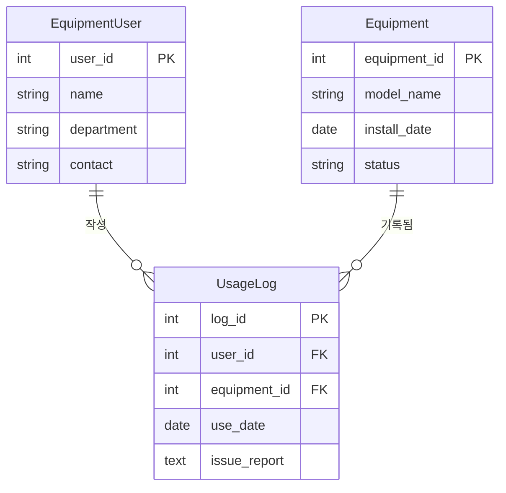

반도체 공장에는 수십 대의 장비가 있고, 하루에도 수백 건의 사용 기록이 쌓입니다. 이 데이터를 엑셀 파일로 관리하면 어떻게 될까요? 파일은 점점 무거워지고, 동시에 여러 사람이 편집하다 보면 데이터가 엉망이 됩니다. **데이터베이스(Database)**는 이 문제를 해결하기 위해 존재합니다.

이번 시리즈에서는 실제 반도체 수업에서 사용하는 **SemiconDB**를 직접 설계하고 구축하면서 데이터베이스의 핵심 개념을 익혀보겠습니다.

---

## 1. 데이터베이스란 무엇인가?

데이터베이스는 **구조화된 데이터의 집합**으로, DBMS(Database Management System)가 이를 관리합니다. 우리는 MySQL을 사용합니다.

| 구분 | 스프레드시트 (엑셀) | 관계형 데이터베이스 (MySQL) |
|------|-------------------|--------------------------|
| 동시 접근 | 어려움 (파일 잠금) | 가능 (다중 사용자 지원) |
| 데이터 무결성 | 직접 관리 필요 | 제약조건으로 자동 보장 |
| 대용량 처리 | 느려짐 | 수백만 건도 빠르게 처리 |
| 관계 표현 | 어려움 | 외래키(FK)로 명확하게 표현 |

---

## 2. 핵심 용어 정리

```
테이블 (Table): 데이터를 저장하는 2차원 구조 (= 엑셀 시트)
행 (Row / Record): 하나의 데이터 단위 (= 장비 1대의 정보)
열 (Column / Field): 데이터의 속성 (= 모델명, 설치일 등)
기본키 (PK, Primary Key): 각 행을 유일하게 식별하는 컬럼
외래키 (FK, Foreign Key): 다른 테이블의 PK를 참조하는 컬럼
```

---

## 3. SemiconDB 설계: 무엇을 관리할까?

반도체 장비 관리 시스템에서 우리가 저장해야 할 정보는 크게 세 가지입니다.

1. **Equipment (장비)**: 공장에 있는 장비들의 모델명, 설치일, 현재 상태
2. **EquipmentUser (사용자)**: 장비를 조작하는 담당자의 이름, 부서, 연락처
3. **UsageLog (사용 이력)**: 누가, 어떤 장비를, 언제 사용했고, 문제는 없었는지

### 3.1 데이터 설계의 지도: ERD (Entity Relationship Diagram)

ERD는 테이블 간의 관계를 시각적으로 표현한 설계도입니다.



- **`||--o{`**: 1:N 관계를 의미합니다.
  - 한 명의 사용자(1)는 여러 개의 로그(N)를 남길 수 있습니다.
  - 하나의 장비(1)는 여러 사용 기록(N)에 등장할 수 있습니다.
- **UsageLog의 역할**: `EquipmentUser`와 `Equipment`를 연결하는 **중간 테이블**입니다.

> [!NOTE]
> 마당서점 DB(Customer - Orders - Book)와 SemiconDB의 구조는 완전히 동일합니다.
> `Customer` → `EquipmentUser`, `Book` → `Equipment`, `Orders` → `UsageLog`

---

## 4. 데이터베이스 & 테이블 구축

### 4.1 데이터베이스 생성

```sql
-- 새 데이터베이스 생성
CREATE DATABASE semicon_equipDB;

-- 사용할 DB 선택
USE semicon_equipDB;
```

### 4.2 MySQL 주요 데이터 타입

| 타입 | 설명 | 사용 예 |
|------|------|---------|
| `INT` | 정수 | user_id, equipment_id |
| `VARCHAR(n)` | 가변 길이 문자열 (최대 n자) | 이름, 모델명 |
| `DATE` | 날짜 (YYYY-MM-DD) | install_date, use_date |
| `TEXT` | 긴 텍스트 | issue_report |
| `DECIMAL(p,s)` | 고정 소수점 (p: 전체 자릿수, s: 소수 자릿수) | 센서 측정값 |

### 4.3 테이블 생성 (순서가 중요!)

외래키(FK)를 참조하는 테이블은 **참조 대상 테이블이 먼저** 생성되어야 합니다.

```sql
-- 기존 테이블이 있으면 삭제 (FK 참조 순서의 역순으로)
DROP TABLE IF EXISTS UsageLog;
DROP TABLE IF EXISTS EquipmentUser;
DROP TABLE IF EXISTS Equipment;

-- 1. 장비 테이블 생성
CREATE TABLE Equipment (
    equipment_id INT PRIMARY KEY,
    model_name   VARCHAR(50),
    install_date DATE,
    status       VARCHAR(20)  -- 'active', 'maintenance', 'retired'
);

-- 2. 장비 사용자 테이블 생성
CREATE TABLE EquipmentUser (
    user_id    INT PRIMARY KEY,
    name       VARCHAR(20),
    department VARCHAR(20),
    contact    VARCHAR(50)
);

-- 3. 사용 기록 테이블 생성 (FK 설정)
CREATE TABLE UsageLog (
    log_id       INT PRIMARY KEY,
    user_id      INT,
    equipment_id INT,
    use_date     DATE,
    issue_report TEXT,
    FOREIGN KEY (user_id)      REFERENCES EquipmentUser(user_id),
    FOREIGN KEY (equipment_id) REFERENCES Equipment(equipment_id)
);
```

> [!IMPORTANT]
> `FOREIGN KEY`를 설정하면 데이터 무결성이 자동으로 보장됩니다.
> 존재하지 않는 `user_id`로 `UsageLog`에 삽입하려 하면 **오류가 발생**합니다.
> 이것이 엑셀과 데이터베이스의 가장 큰 차이입니다!

---

## 5. 샘플 데이터 로드

```sql
-- Equipment 데이터 삽입
INSERT INTO Equipment VALUES
(101, 'ETCH-A100',  '2021-05-10', 'active'),
(102, 'CMP-X200',   '2023-11-23', 'maintenance'),
(103, 'LITHO-Z300', '2022-07-15', 'active'),
(104, 'CVD-B500',   '2019-03-12', 'retired'),
(105, 'DIFF-Y700',  '2023-01-20', 'active');

-- EquipmentUser 데이터 삽입
INSERT INTO EquipmentUser VALUES
(1, '김지훈', '품질팀',   '010-1234-5678'),
(2, '박서윤', '제조팀',   '010-2345-6789'),
(3, '이준호', '품질팀',   '010-3456-7890'),
(4, '김민아', '개발팀',   '010-4567-8901'),
(5, '정예린', '연구팀',   '010-5678-9012');

-- UsageLog 데이터 삽입
INSERT INTO UsageLog VALUES
(1,  1, 101, '2024-03-01', '챔버 압력 이상'),
(2,  2, 103, '2024-03-02', NULL),
(3,  3, 102, '2024-03-05', '연마 균일도 문제'),
(4,  1, 104, '2024-03-07', NULL),
(5,  4, 101, '2024-03-08', '이물 감지 센서 오작동'),
(6,  5, 105, '2024-03-10', NULL),
(7,  3, 103, '2024-03-11', NULL),
(8,  2, 105, '2024-03-12', '예열 지연'),
(9,  1, 102, '2024-03-13', NULL),
(10, 4, 103, '2024-03-14', '패턴 비정상'),
(11, 5, 101, '2024-03-15', NULL);
```

---

## 6. 데이터 확인

```sql
-- 전체 데이터 조회
SELECT * FROM Equipment;
SELECT * FROM EquipmentUser;
SELECT * FROM UsageLog;
```

| equipment_id | model_name | install_date | status |
|---|---|---|---|
| 101 | ETCH-A100 | 2021-05-10 | active |
| 102 | CMP-X200 | 2023-11-23 | maintenance |
| 103 | LITHO-Z300 | 2022-07-15 | active |
| 104 | CVD-B500 | 2019-03-12 | retired |
| 105 | DIFF-Y700 | 2023-01-20 | active |

---

## 7. 정리

이번 강에서 배운 핵심 개념을 정리합니다.

| 개념 | 설명 |
|------|------|
| **테이블** | 데이터를 저장하는 2차원 구조 |
| **PK (기본키)** | 각 행을 유일하게 식별 |
| **FK (외래키)** | 다른 테이블의 PK를 참조, 무결성 보장 |
| **1:N 관계** | 하나의 부모 ↔ 여러 자식 레코드 |
| **ERD** | 테이블 간 관계를 시각화한 설계도 |

다음 강에서는 이 데이터를 바탕으로 **WHERE, ORDER BY, LIKE**를 활용한 정밀한 데이터 조회 방법을 배워보겠습니다.
