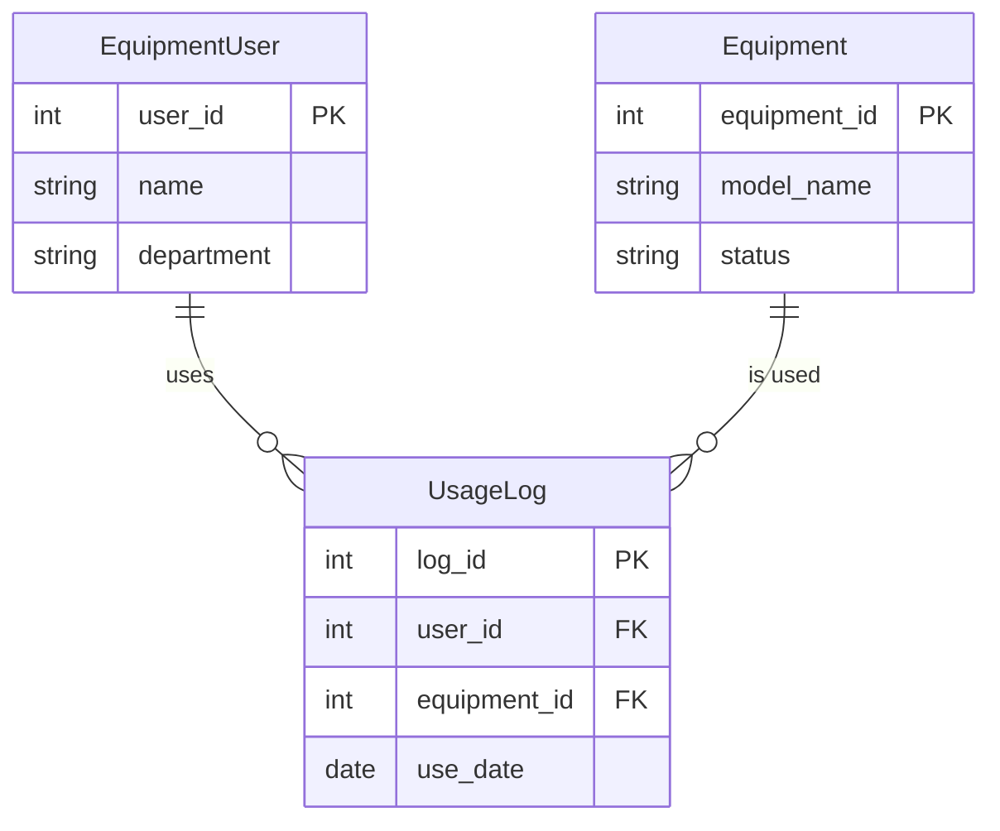

단순한 데이터 저장을 넘어, 수많은 장비와 공정 데이터를 효율적으로 관리하기 위해서는 체계적인 **데이터베이스 설계**가 필수적입니다. 이번 시리즈에서는 **반도체 장비 관리 시스템(SemiconDB)**을 구축하며 SQL의 기초부터 심화까지 학습해 보겠습니다.

---

## 1. SemiconDB 테이블 구조 (Schema)
우리가 관리할 데이터는 크게 세 가지 영역으로 나뉩니다.

1.  **Equipment (장비)**: 공정에 사용되는 장비들의 모델명, 도입일, 현재 상태를 관리합니다.
2.  **EquipmentUser (사용자)**: 장비를 조작하는 담당자들의 부서와 연락처 정보를 담습니다.
3.  **UsageLog (사용 이력)**: 어떤 사용자가 어떤 장비를 언제 사용했는지, 그리고 특이사항(문제 보고)은 없었는지 기록합니다.

### 1.2. 데이터 설계의 지도: ERD (Entity Relationship Diagram)
설계 단계에서 테이블 간의 관계를 시각화한 것을 **ERD**라고 합니다. SemiconDB의 관계는 다음과 같습니다.



- **1:N 관계**: 한 명의 사용자(1)는 여러 번의 로그(N)를 남길 수 있고, 하나의 장비(1)는 여러 기록(N)에 등장할 수 있습니다.

---

## 2. 데이터베이스 및 테이블 구축
실습을 위해 MySQL을 사용하여 테이블을 생성하고 샘플 데이터를 로드해 보겠습니다.

```sql
-- 1. 데이터베이스 생성 및 선택
CREATE DATABASE semicon_equipDB;
USE semicon_equipDB;

-- 2. 장비 테이블 생성
CREATE TABLE Equipment (
    equipment_id INT PRIMARY KEY,
    model_name VARCHAR(50),
    install_date DATE,
    status VARCHAR(20) -- active, maintenance, retired 등
);

-- 3. 장비 사용자 테이블 생성
CREATE TABLE EquipmentUser (
    user_id INT PRIMARY KEY,
    name VARCHAR(20),
    department VARCHAR(20),
    contact VARCHAR(50)
);

-- 4. 장비 사용 기록 테이블 생성 (외래키 설정)
CREATE TABLE UsageLog (
    log_id INT PRIMARY KEY,
    user_id INT,
    equipment_id INT,
    use_date DATE,
    issue_report TEXT,
    FOREIGN KEY (user_id) REFERENCES EquipmentUser(user_id),
    FOREIGN KEY (equipment_id) REFERENCES Equipment(equipment_id)
);
```

---

## 3. 샘플 데이터 로드
실무적인 쿼리 연습을 위해 아래와 같이 데이터를 삽입합니다.

```sql
-- 장비 데이터 삽입
INSERT INTO Equipment VALUES (101, 'ETCH-A100', '2021-05-10', 'active'),
                             (102, 'CMP-X200', '2023-11-23', 'maintenance');

-- 사용자 데이터 삽입
INSERT INTO EquipmentUser VALUES (1, '김지훈', '품질팀', '010-1234-5678'),
                                 (2, '박서윤', '제조팀', '010-2345-6789');

-- 사용 로그 삽입
INSERT INTO UsageLog VALUES (1, 1, 101, '2024-03-01', '챔버 압력 이상'),
                            (2, 2, 103, '2024-03-02', NULL);
```

이제 실습을 위한 모든 준비가 끝났습니다. 다음 포스트에서는 이 데이터를 바탕으로 **원하는 정보만 골라내는 조회 기술**에 대해 알아보겠습니다.
