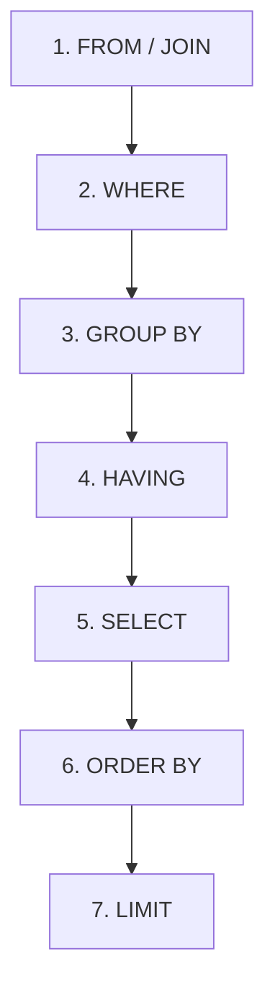

단순한 개별 데이터 조회에서 나아가, 전체적인 흐름을 파악하기 위해서는 데이터를 그룹화하고 요약하는 기술이 필요합니다. 이번 포스트에서는 **GROUP BY**가 왜 집계 함수와 함께 쓰이는지, 그리고 SQL이 내부적으로 어떤 순서로 실행되는지 깊이 있게 다뤄보겠습니다.

---

## 1. GROUP BY와 집계 함수의 관계
많은 입문자가 "왜 GROUP BY를 쓸 때 SELECT 절에 일반 컬럼을 마음대로 넣으면 안 되나요?"라는 질문을 합니다. 그 이유는 **데이터의 압축**에 있습니다.

### 왜 집계 함수가 필요한가?
예를 들어, `UsageLog` 테이블에 김지훈 사용자의 기록이 10건 있다고 가정해 봅시다.
- `GROUP BY user_id`를 실행하면 10개의 행이 **하나의 행**으로 합쳐집니다.
- 이때 '날짜' 컬럼을 그냥 보여달라고 하면, 컴퓨터는 10개의 날짜 중 어떤 것을 보여줘야 할지 알 수 없습니다.
- 그래서 **"합쳐진 10개 데이터의 개수(COUNT)를 알려줘"** 혹은 **"가장 최근 날짜(MAX)를 알려줘"**와 같이 명확한 요약 방식(집계 함수)을 지정해야 하는 것입니다.

```sql
-- 잘못된 예: 어떤 날짜를 보여줄지 불분명함
SELECT user_id, use_date FROM UsageLog GROUP BY user_id; 

-- 올바른 예: 그룹화된 데이터의 요약 방식을 지정
SELECT user_id, COUNT(*) AS 사용횟수, MAX(use_date) AS 최근사용일 
FROM UsageLog 
GROUP BY user_id;
```

---

## 2. SQL의 실행 순서 (Execution Order)
우리가 SQL을 **작성하는 순서**와 데이터베이스 엔진이 이를 **해석하는 순서**는 다릅니다. 이 순서를 알면 쿼리 오류를 줄이고 성능을 이해하는 데 큰 도움이 됩니다.

### SQL 실행 순서도


1.  **FROM / JOIN**: 어떤 테이블에서 데이터를 가져올지 결정합니다. (가장 먼저 실행)
2.  **WHERE**: 개별 행을 필터링합니다. (집계 전)
3.  **GROUP BY**: 데이터를 그룹으로 묶습니다.
4.  **HAVING**: 그룹화된 결과 중 필요한 것만 남깁니다. (집계 후 필터링)
5.  **SELECT**: 어떤 컬럼을 보여줄지 결정하고 별칭(Alias)을 부여합니다.
6.  **ORDER BY**: 결과를 정렬합니다.
7.  **LIMIT**: 최종 결과의 개수를 제한합니다.

> [!IMPORTANT]
> `SELECT` 절에서 정한 별칭(Alias)을 `WHERE` 절에서 쓸 수 없는 이유는 `WHERE`가 `SELECT`보다 먼저 실행되기 때문입니다!

---

## 3. 실무 응용: WHERE vs HAVING
- **WHERE**: "일단 2024년 기록만 다 가져와!"
- **HAVING**: "그중에서 사용 횟수가 2번 넘는 사람만 골라내!"

```sql
SELECT user_id, COUNT(*) AS 사용횟수 
FROM UsageLog 
WHERE use_date >= '2024-01-01' -- 집계 전 필터링
GROUP BY user_id                
HAVING COUNT(*) >= 2;          -- 집계 후 필터링
```

이처럼 실행 순서와 집계의 원리를 이해하면 아무리 복잡한 통계 쿼리도 논리적으로 작성할 수 있습니다. 다음 시간에는 흩어진 테이블을 하나로 합치는 **JOIN**에 대해 알아보겠습니다.
