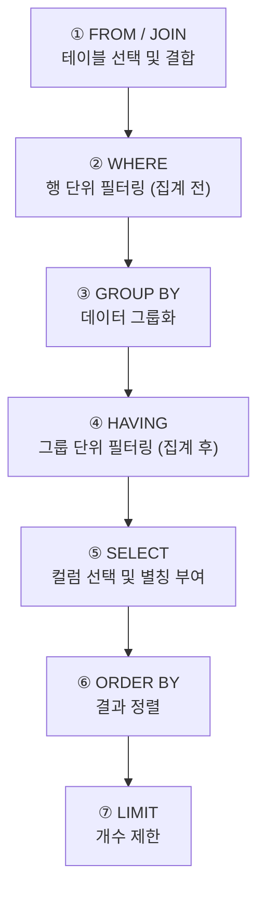

단순히 행을 골라내는 것을 넘어, **"장비별로 몇 번 사용됐나?", "부서별 이슈 발생 건수는?"** 같은 통계 질문에 답하려면 데이터를 **그룹화**해야 합니다. `GROUP BY`와 집계 함수는 SQL의 분석 능력을 한 차원 끌어올리는 핵심 도구입니다.

---

## 1. 집계 함수 (Aggregate Functions)

집계 함수는 여러 행의 값을 **하나의 값으로 요약**합니다.

| 함수 | 설명 | 사용 예 |
|------|------|---------|
| `COUNT(*)` | 전체 행 수 | 총 사용 기록 수 |
| `COUNT(컬럼)` | NULL 제외 행 수 | 이슈 보고 건수 |
| `SUM(컬럼)` | 합계 | 총 매출 |
| `AVG(컬럼)` | 평균 | 평균 사용 횟수 |
| `MAX(컬럼)` | 최댓값 | 가장 최근 사용일 |
| `MIN(컬럼)` | 최솟값 | 가장 오래된 설치일 |

### COUNT(*) vs COUNT(컬럼) 차이

```sql
-- COUNT(*): NULL 포함 전체 행 수
SELECT COUNT(*) AS 총로그수 FROM UsageLog;        -- 결과: 11

-- COUNT(컬럼): 해당 컬럼이 NULL이 아닌 행의 수
SELECT COUNT(issue_report) AS 이슈발생건수 FROM UsageLog;  -- 결과: 6 (NULL 제외)
```

---

## 2. GROUP BY: 데이터 그룹화

### 2.1 GROUP BY가 필요한 이유

> "장비별로 몇 번 사용됐나요?"

이 질문에 답하려면 같은 `equipment_id`를 가진 행들을 **하나의 그룹으로 묶어야** 합니다.

```sql
-- 장비별 사용 횟수
SELECT equipment_id, COUNT(*) AS 사용횟수
FROM UsageLog
GROUP BY equipment_id;
```

### 2.2 왜 집계 함수가 필요한가? (핵심 원리)

```sql
-- ❌ 잘못된 쿼리: 어떤 날짜를 보여줄지 알 수 없음
SELECT user_id, use_date FROM UsageLog GROUP BY user_id;

-- ✅ 올바른 쿼리: 날짜를 "최근 날짜"로 요약 방식 지정
SELECT user_id, 
       COUNT(*) AS 사용횟수, 
       MAX(use_date) AS 최근사용일
FROM UsageLog 
GROUP BY user_id;
```

`GROUP BY`를 쓰면 10개의 행이 **하나의 행으로 압축**됩니다. 이때 압축되지 않은 컬럼을 그냥 SELECT하면 "10개 중 어떤 값을 보여줄까요?"라는 질문에 MySQL이 답할 수 없습니다. 그래서 반드시 `COUNT`, `MAX` 같은 **집계 함수로 요약 방식을 지정**해야 합니다.

---

## 3. GROUP BY 실전 예제 (SemiconDB)

### 예제 1: 장비별 사용 횟수와 이슈 보고 건수

```sql
SELECT 
    equipment_id,
    COUNT(*) AS 총사용횟수,
    COUNT(issue_report) AS 이슈보고건수,
    MAX(use_date) AS 최근사용일,
    MIN(use_date) AS 최초사용일
FROM UsageLog
GROUP BY equipment_id;
```

### 예제 2: 사용자별 활동 통계

```sql
SELECT 
    user_id,
    COUNT(*) AS 사용횟수,
    COUNT(issue_report) AS 이슈보고수,
    MAX(use_date) AS 마지막사용일
FROM UsageLog
GROUP BY user_id
ORDER BY 사용횟수 DESC;  -- 많이 사용한 사람 순
```

### 예제 3: 부서별 이슈 발생 현황 (GROUP BY + WHERE)

```sql
-- 2024년 3월 5일 이후 기록 중 부서별 이슈 건수
SELECT 
    department,
    COUNT(u.log_id) AS 사용횟수,
    COUNT(u.issue_report) AS 이슈건수
FROM EquipmentUser AS eu
JOIN UsageLog AS u ON eu.user_id = u.user_id
WHERE u.use_date >= '2024-03-05'           -- 집계 전 필터링
GROUP BY eu.department;
```

---

## 4. SQL 실행 순서 (핵심 개념!)

SQL을 **작성하는 순서**와 데이터베이스가 **실행하는 순서**는 다릅니다!



> [!IMPORTANT]
> **SELECT에서 정의한 별칭(Alias)을 WHERE에서 쓸 수 없는 이유**는 `WHERE`가 `SELECT`보다 먼저 실행되기 때문입니다!
> ```sql
> -- ❌ 오류: WHERE는 SELECT보다 먼저 실행되므로 '사용횟수' 별칭을 모름
> SELECT COUNT(*) AS 사용횟수 FROM UsageLog WHERE 사용횟수 >= 2;
>
> -- ✅ 올바른 방법: HAVING 사용
> SELECT COUNT(*) AS 사용횟수 FROM UsageLog GROUP BY user_id HAVING COUNT(*) >= 2;
> ```

---

## 5. HAVING: 그룹 필터링

`WHERE`가 **행 단위** 필터링이라면, `HAVING`은 **GROUP BY 이후** 그룹 단위 필터링입니다.

### WHERE vs HAVING 비교

```sql
-- WHERE: "2024-03-05 이후 기록"만 대상으로 집계 (집계 전 필터)
-- HAVING: 집계 결과 중 "사용 횟수 2회 이상"만 출력 (집계 후 필터)

SELECT user_id, COUNT(*) AS 사용횟수
FROM UsageLog
WHERE use_date >= '2024-03-05'   -- ① 먼저 5일 이후 데이터만 남김
GROUP BY user_id
HAVING COUNT(*) >= 2;            -- ② 그룹화 후 2회 이상만 남김
```

### 실전 예제: GROUP BY + WHERE + HAVING 조합

```sql
-- Q: 이슈가 1건 이상 보고된 장비를 조회하세요 (단, 2024-03-10 이후 기록만)
SELECT 
    equipment_id,
    COUNT(*) AS 사용횟수,
    COUNT(issue_report) AS 이슈건수
FROM UsageLog
WHERE use_date >= '2024-03-10'        -- 집계 전: 날짜 필터
GROUP BY equipment_id
HAVING COUNT(issue_report) >= 1       -- 집계 후: 이슈 건수 필터
ORDER BY 이슈건수 DESC;
```

---

## 6. GROUP BY 25문제 패턴 정리

수업에서 배운 25가지 GROUP BY 문제 패턴을 정리했습니다.

### [1단계] GROUP BY 단독 (중복 제거)

```sql
-- Q1: 장비 상태 목록 (중복 없이)
SELECT status FROM Equipment GROUP BY status;
-- 또는: SELECT DISTINCT status FROM Equipment;

-- Q2: 사용 기록이 있는 장비 ID 목록
SELECT equipment_id FROM UsageLog GROUP BY equipment_id;

-- Q3: 사용 기록이 있는 날짜 목록
SELECT use_date FROM UsageLog GROUP BY use_date;
```

### [2단계] GROUP BY + 집계함수

```sql
-- Q4: 장비별 사용 횟수
SELECT equipment_id, COUNT(*) AS 사용횟수
FROM UsageLog GROUP BY equipment_id;

-- Q5: 장비별 이슈 보고 건수 (NULL 제외)
SELECT equipment_id, COUNT(issue_report) AS 이슈건수
FROM UsageLog GROUP BY equipment_id;

-- Q6: 사용자별 최근 사용일
SELECT user_id, MAX(use_date) AS 최근사용일
FROM UsageLog GROUP BY user_id;

-- Q7: 장비별 최초 사용일
SELECT equipment_id, MIN(use_date) AS 최초사용일
FROM UsageLog GROUP BY equipment_id;
```

### [3단계] GROUP BY + HAVING

```sql
-- Q8: 사용 횟수가 2회 이상인 장비
SELECT equipment_id, COUNT(*) AS 사용횟수
FROM UsageLog
GROUP BY equipment_id
HAVING COUNT(*) >= 2;

-- Q9: 이슈 보고가 1건 이상 있는 장비
SELECT equipment_id, COUNT(issue_report) AS 이슈건수
FROM UsageLog
GROUP BY equipment_id
HAVING COUNT(issue_report) >= 1;

-- Q10: 가장 최근 사용일이 2024-03-12 이후인 사용자
SELECT user_id, MAX(use_date) AS 최근사용일
FROM UsageLog
GROUP BY user_id
HAVING MAX(use_date) >= '2024-03-12';
```

### [4단계] WHERE + GROUP BY + HAVING (종합)

```sql
-- Q11: 2024-03-05 이후 기록만 대상으로, 사용 횟수 2회 이상인 장비
SELECT equipment_id, COUNT(*) AS 사용횟수
FROM UsageLog
WHERE use_date >= '2024-03-05'
GROUP BY equipment_id
HAVING COUNT(*) >= 2;

-- Q12: 이슈가 있는 기록만 대상으로, 2건 이상 발생한 장비
SELECT equipment_id, COUNT(issue_report) AS 이슈건수
FROM UsageLog
WHERE issue_report IS NOT NULL
GROUP BY equipment_id
HAVING COUNT(issue_report) >= 2;
```

---

## 7. 핵심 정리

| 개념 | 설명 |
|------|------|
| **GROUP BY** | 지정 컬럼의 같은 값끼리 그룹화 |
| **집계 함수** | 그룹을 하나의 값으로 요약 (COUNT, MAX 등) |
| **HAVING** | GROUP BY 이후 그룹 단위 필터링 |
| **WHERE vs HAVING** | WHERE = 집계 전, HAVING = 집계 후 |
| **SQL 실행 순서** | FROM → WHERE → GROUP BY → HAVING → SELECT → ORDER BY → LIMIT |

다음 강에서는 흩어진 여러 테이블을 하나로 묶는 **JOIN**의 원리와 활용법을 깊이 있게 다뤄보겠습니다.
