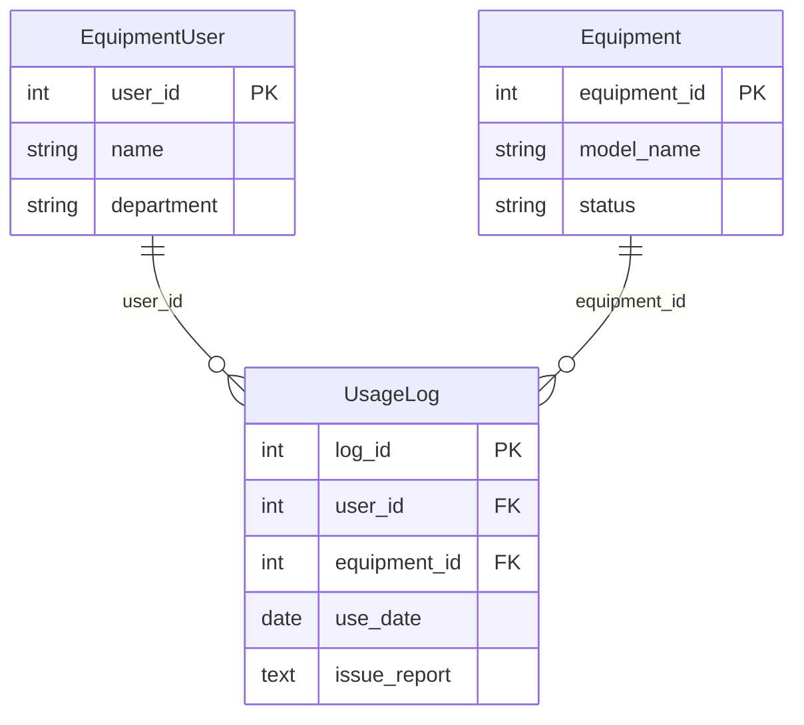
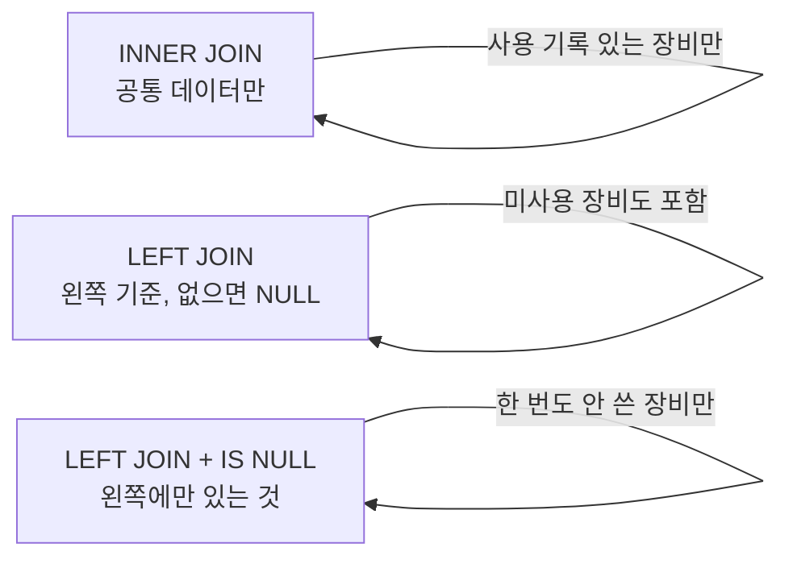

실제 데이터베이스에서 우리가 원하는 정보는 여러 테이블에 흩어져 있습니다. **"김지훈이 어떤 장비를 몇 번 사용했나?"** 라는 질문에 답하려면 `EquipmentUser`, `UsageLog`, `Equipment` 세 테이블의 정보를 하나로 합쳐야 합니다. 이것이 **JOIN**입니다.

---

## 1. JOIN이 필요한 이유

SemiconDB의 구조를 다시 떠올려 봅시다.



- `UsageLog`에는 `user_id`(번호)만 있고, **이름(name)은 없습니다.**
- `UsageLog`에는 `equipment_id`(번호)만 있고, **모델명(model_name)은 없습니다.**
- 이름과 모델명을 함께 보려면 JOIN이 필수입니다!

---

## 2. INNER JOIN (내부 조인)

**양쪽 테이블 모두에 일치하는 데이터만** 결합합니다.

```sql
-- 기본 문법
SELECT 컬럼 FROM 테이블A
INNER JOIN 테이블B ON A.공통키 = B.공통키;

-- INNER 생략 가능 (그냥 JOIN이라고 써도 동일)
SELECT 컬럼 FROM 테이블A
JOIN 테이블B ON A.공통키 = B.공통키;
```

### 예제 1: 사용 기록 + 사용자 이름 + 장비 모델명

```sql
SELECT 
    u.log_id,
    eu.name AS 사용자,
    e.model_name AS 장비명,
    u.use_date AS 사용일,
    u.issue_report AS 이슈내용
FROM UsageLog AS u
JOIN Equipment    AS e  ON u.equipment_id = e.equipment_id
JOIN EquipmentUser AS eu ON u.user_id = eu.user_id
ORDER BY u.use_date;
```

### 예제 2: 이슈가 보고된 기록만 (JOIN + WHERE)

```sql
SELECT 
    eu.name AS 담당자,
    e.model_name AS 장비,
    u.use_date,
    u.issue_report
FROM UsageLog AS u
JOIN EquipmentUser AS eu ON u.user_id = eu.user_id
JOIN Equipment    AS e  ON u.equipment_id = e.equipment_id
WHERE u.issue_report IS NOT NULL
ORDER BY u.use_date DESC;
```

### 예제 3: 품질팀이 사용한 장비 목록

```sql
SELECT DISTINCT e.model_name, e.status
FROM UsageLog AS u
JOIN EquipmentUser AS eu ON u.user_id = eu.user_id
JOIN Equipment    AS e  ON u.equipment_id = e.equipment_id
WHERE eu.department = '품질팀';
```

---

## 3. LEFT JOIN (왼쪽 외부 조인)

**왼쪽 테이블의 모든 데이터를 유지**하고, 오른쪽 테이블에 일치하는 게 없으면 `NULL`로 채웁니다.

```sql
-- 기본 문법
SELECT 컬럼 FROM 테이블A (왼쪽, 기준)
LEFT JOIN 테이블B ON A.공통키 = B.공통키;
```

### INNER JOIN vs LEFT JOIN 비교

```sql
-- INNER JOIN: 사용 기록이 있는 장비만 출력
SELECT e.model_name, u.use_date
FROM Equipment AS e
JOIN UsageLog AS u ON e.equipment_id = u.equipment_id;

-- LEFT JOIN: 사용 기록이 없는 장비도 포함 (use_date = NULL로 표시)
SELECT e.model_name, u.use_date
FROM Equipment AS e
LEFT JOIN UsageLog AS u ON e.equipment_id = u.equipment_id;
```

> [!TIP]
> **"한 번도 사용되지 않은 장비를 찾아라"** 같은 문제는 항상 LEFT JOIN + `WHERE IS NULL` 패턴입니다!

### LEFT JOIN의 결과 이해

| 장비 | 사용일 (INNER JOIN) | 사용일 (LEFT JOIN) |
|------|--------------------|--------------------|
| ETCH-A100 | 2024-03-01 등 | 2024-03-01 등 |
| CMP-X200 | 2024-03-05 등 | 2024-03-05 등 |
| CVD-B500 | (미사용 → 결과 없음) | **NULL** (포함됨!) |

---

## 4. "존재하지 않는 것" 찾기: LEFT JOIN + IS NULL

LEFT JOIN의 핵심 활용 패턴입니다.

```sql
-- 한 번도 사용된 적 없는 장비 찾기
SELECT e.equipment_id, e.model_name, e.status
FROM Equipment AS e
LEFT JOIN UsageLog AS u ON e.equipment_id = u.equipment_id
WHERE u.log_id IS NULL;  -- UsageLog에 매칭이 없는 행
```

### 응용: 사용 기록이 없는 사용자 찾기

```sql
-- 한 번도 장비를 사용하지 않은 사용자
SELECT eu.user_id, eu.name, eu.department
FROM EquipmentUser AS eu
LEFT JOIN UsageLog AS u ON eu.user_id = u.user_id
WHERE u.log_id IS NULL;
```

---

## 5. LEFT JOIN + GROUP BY 조합

**"모든 장비의 사용 횟수를 조회하되, 사용된 적 없는 장비도 포함"**

```sql
-- 모든 사용자의 사용 횟수 (미사용자도 포함, 횟수 = 0으로 표시)
SELECT 
    eu.user_id,
    eu.name,
    eu.department,
    COUNT(u.log_id) AS 사용횟수,
    COUNT(u.issue_report) AS 이슈보고횟수
FROM EquipmentUser AS eu
LEFT JOIN UsageLog AS u ON eu.user_id = u.user_id
GROUP BY eu.user_id, eu.name, eu.department
ORDER BY 사용횟수 DESC;
```

```sql
-- 모든 장비의 사용 횟수와 이슈 발생 횟수
SELECT 
    e.equipment_id,
    e.model_name,
    e.status,
    COUNT(u.log_id) AS 사용횟수,
    COUNT(u.issue_report) AS 이슈건수
FROM Equipment AS e
LEFT JOIN UsageLog AS u ON e.equipment_id = u.equipment_id
GROUP BY e.equipment_id, e.model_name, e.status
ORDER BY 이슈건수 DESC;
```

> [!IMPORTANT]
> `COUNT(*)`는 NULL도 포함해서 세지만, `COUNT(컬럼명)`은 NULL을 제외합니다.
> LEFT JOIN 후 COUNT할 때는 **반드시 오른쪽 테이블의 컬럼을 지정**하세요!
> `COUNT(u.log_id)` → 사용 기록이 없는 행은 NULL이므로 0으로 집계됩니다.

---

## 6. 3테이블 JOIN 실전

### 예제: 사용자 이름 + 장비 모델명 + 사용 현황 전체 조회

```sql
-- 모든 사용자 기준으로, 사용한 장비 모델명과 횟수를 조회
-- (사용 기록 없는 사용자도 포함)
SELECT 
    eu.name AS 사용자,
    eu.department AS 부서,
    e.model_name AS 장비모델명,
    COUNT(u.log_id) AS 사용횟수
FROM EquipmentUser AS eu
LEFT JOIN UsageLog AS u ON eu.user_id = u.user_id
LEFT JOIN Equipment AS e ON u.equipment_id = e.equipment_id
GROUP BY eu.user_id, eu.name, eu.department, e.model_name
ORDER BY eu.name, 사용횟수 DESC;
```

### 예제: 이슈가 있는 사용자와 해당 장비를 최신순으로

```sql
SELECT 
    eu.name AS 담당자,
    eu.department AS 부서,
    e.model_name AS 장비명,
    u.use_date AS 사용일,
    u.issue_report AS 이슈내용
FROM UsageLog AS u
JOIN EquipmentUser AS eu ON u.user_id = eu.user_id
JOIN Equipment    AS e  ON u.equipment_id = e.equipment_id
WHERE u.issue_report IS NOT NULL
ORDER BY u.use_date DESC;
```

---

## 7. 서브쿼리: 쿼리 속의 쿼리

서브쿼리는 복잡한 조건을 처리할 때 활용합니다.

```sql
-- "가장 최근에 설치된 장비의 사용 기록만 조회"
SELECT * FROM UsageLog
WHERE equipment_id = (
    SELECT equipment_id FROM Equipment 
    ORDER BY install_date DESC 
    LIMIT 1
);

-- "이슈가 한 번이라도 있었던 장비의 모델명 조회"
SELECT model_name FROM Equipment
WHERE equipment_id IN (
    SELECT DISTINCT equipment_id FROM UsageLog 
    WHERE issue_report IS NOT NULL
);
```

---

## 8. JOIN 유형 비교 정리



| JOIN 종류 | 결과 | 활용 상황 |
|-----------|------|-----------|
| `INNER JOIN` | 양쪽 모두 있는 데이터 | 실제 사용된 기록 조회 |
| `LEFT JOIN` | 왼쪽 전체 + 오른쪽 NULL | 미사용 포함 전체 현황 |
| `LEFT JOIN + IS NULL` | 왼쪽에만 있는 것 | 한 번도 사용 안 된 장비 |

다음 강에서는 데이터를 **직접 추가(INSERT), 수정(UPDATE), 삭제(DELETE)**하는 DML과 테이블 구조를 변경하는 **DDL**의 모든 것을 다뤄보겠습니다.
