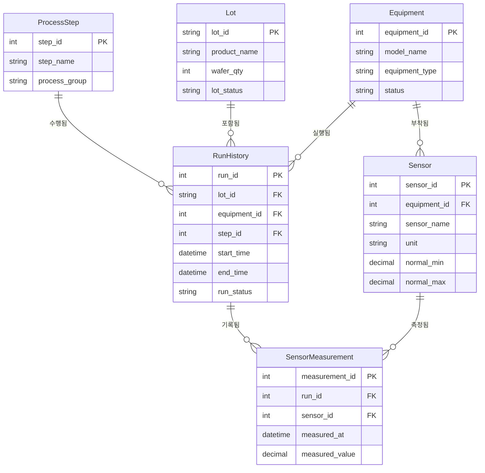
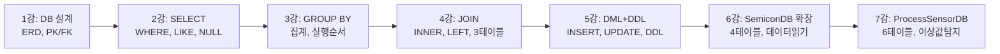

SemiconDB가 **"누가 어떤 장비를 사용했나?"** 를 관리했다면, **ProcessSensorDB**는 한 단계 더 나아가 **"공정 중에 어떤 값이 측정됐나?"** 를 관리합니다. 실제 반도체 공장에서는 장비의 온도, 압력, 가스 유량 등을 수천 개의 센서로 실시간 모니터링합니다. 이번 강에서는 6개 테이블로 구성된 복잡한 DB를 설계하고, SQL로 이상값을 탐지해 보겠습니다.

---

## 1. ProcessSensorDB 전체 구조



---

## 2. 반도체 공정의 흐름 이해

```
Lot(웨이퍼 묶음)
  └─ RunHistory: L001이 ETCH-A100에서 '식각 공정' 수행 (2024-03-15 10:00 ~ 10:25)
       └─ SensorMeasurement: 이 Run 동안 rf_power = 500W, gas_flow = 100sccm 측정
```

**6개 테이블의 역할:**

| 테이블 | 역할 |
|--------|------|
| `ProcessStep` | 공정 단계 정의 (산화막 증착, 식각, 세정, 검사) |
| `Lot` | 생산 단위 (웨이퍼 25장 묶음) |
| `Equipment` | 장비 목록 (CVD, ETCH, CLEAN, INSPECT) |
| `RunHistory` | 실제 공정 실행 이력 (언제, 어떤 장비로, 어떤 공정을) |
| `Sensor` | 장비에 부착된 센서 (이름, 단위, 정상 범위) |
| `SensorMeasurement` | 실제 센서 측정값 (초당 or 분당 기록) |

---

## 3. ProcessSensorDB 구축

```sql
DROP DATABASE IF EXISTS ProcessSensorDB;
CREATE DATABASE ProcessSensorDB;
USE ProcessSensorDB;

-- 1. 공정 단계
CREATE TABLE ProcessStep (
    step_id      INT PRIMARY KEY,
    step_name    VARCHAR(50) NOT NULL,
    process_group VARCHAR(50) NOT NULL
);

INSERT INTO ProcessStep VALUES
(1, '산화막 증착', 'Deposition'),
(2, '식각 공정',   'Etch'),
(3, '세정 공정',   'Cleaning'),
(4, '검사 공정',   'Inspection');

-- 2. 생산 Lot
CREATE TABLE Lot (
    lot_id       VARCHAR(10) PRIMARY KEY,
    product_name VARCHAR(50) NOT NULL,
    wafer_qty    INT NOT NULL,
    lot_status   VARCHAR(20) NOT NULL  -- 'processing', 'completed', 'warning'
);

INSERT INTO Lot VALUES
('L001', 'DRAM-A', 25, 'processing'),
('L002', 'DRAM-A', 25, 'completed'),
('L003', 'NAND-B', 25, 'warning');

-- 3. 장비
CREATE TABLE Equipment (
    equipment_id   INT PRIMARY KEY,
    model_name     VARCHAR(50) NOT NULL,
    equipment_type VARCHAR(50) NOT NULL,
    status         VARCHAR(20) NOT NULL
);

INSERT INTO Equipment VALUES
(101, 'CVD-B200',     'Deposition', 'active'),
(102, 'ETCH-A100',    'Etch',       'active'),
(103, 'CLEAN-D300',   'Cleaning',   'active'),
(104, 'INSPECT-E500', 'Inspection', 'active');

-- 4. 공정 실행 이력 (Run)
CREATE TABLE RunHistory (
    run_id       INT PRIMARY KEY,
    lot_id       VARCHAR(10) NOT NULL,
    equipment_id INT NOT NULL,
    step_id      INT NOT NULL,
    start_time   DATETIME NOT NULL,
    end_time     DATETIME NOT NULL,
    run_status   VARCHAR(20) NOT NULL,
    FOREIGN KEY (lot_id)       REFERENCES Lot(lot_id),
    FOREIGN KEY (equipment_id) REFERENCES Equipment(equipment_id),
    FOREIGN KEY (step_id)      REFERENCES ProcessStep(step_id)
);

INSERT INTO RunHistory VALUES
(1, 'L001', 101, 1, '2024-03-15 09:00:00', '2024-03-15 09:30:00', 'completed'),
(2, 'L001', 102, 2, '2024-03-15 10:00:00', '2024-03-15 10:25:00', 'completed'),
(3, 'L001', 103, 3, '2024-03-15 10:40:00', '2024-03-15 10:55:00', 'completed'),
(4, 'L002', 101, 1, '2024-03-15 11:10:00', '2024-03-15 11:45:00', 'completed'),
(5, 'L002', 102, 2, '2024-03-15 12:10:00', '2024-03-15 12:35:00', 'completed'),
(6, 'L002', 104, 4, '2024-03-15 13:00:00', '2024-03-15 13:20:00', 'completed'),
(7, 'L003', 101, 1, '2024-03-15 14:00:00', '2024-03-15 14:35:00', 'warning'),
(8, 'L003', 102, 2, '2024-03-15 15:00:00', '2024-03-15 15:30:00', 'warning');

-- 5. 센서 정의 (정상 범위 포함)
CREATE TABLE Sensor (
    sensor_id    INT PRIMARY KEY,
    equipment_id INT NOT NULL,
    sensor_name  VARCHAR(50) NOT NULL,
    unit         VARCHAR(20) NOT NULL,
    normal_min   DECIMAL(10,2) NOT NULL,
    normal_max   DECIMAL(10,2) NOT NULL,
    FOREIGN KEY (equipment_id) REFERENCES Equipment(equipment_id)
);

INSERT INTO Sensor VALUES
(1, 101, 'chamber_temp',     'C',     390.00, 410.00),
(2, 101, 'chamber_pressure', 'Torr',  1.80,   2.20),
(3, 102, 'rf_power',         'W',     480.00, 520.00),
(4, 102, 'gas_flow',         'sccm',  95.00,  105.00),
(5, 103, 'cleaning_flow',    'L/min', 18.00,  22.00),
(6, 103, 'chemical_temp',    'C',     23.00,  27.00),
(7, 104, 'defect_count',     'count', 0.00,   5.00),
(8, 104, 'inspection_temp',  'C',     22.00,  28.00);

-- 6. 센서 측정값
CREATE TABLE SensorMeasurement (
    measurement_id INT PRIMARY KEY,
    run_id         INT NOT NULL,
    sensor_id      INT NOT NULL,
    measured_at    DATETIME NOT NULL,
    measured_value DECIMAL(10,2) NOT NULL,
    FOREIGN KEY (run_id)   REFERENCES RunHistory(run_id),
    FOREIGN KEY (sensor_id) REFERENCES Sensor(sensor_id)
);
```

---

## 4. 기초 데이터 조회

### 4.1 warning 상태인 Lot와 Run 확인

```sql
-- warning Lot 조회
SELECT lot_id, product_name, lot_status 
FROM Lot 
WHERE lot_status = 'warning';

-- warning Run 조회 (어떤 장비에서?)
SELECT r.run_id, r.lot_id, e.model_name, ps.step_name, r.run_status
FROM RunHistory AS r
JOIN Equipment  AS e  ON r.equipment_id = e.equipment_id
JOIN ProcessStep AS ps ON r.step_id = ps.step_id
WHERE r.run_status = 'warning';
```

### 4.2 Lot별 공정 흐름 확인

```sql
-- L001이 어떤 공정 단계를 거쳤는가?
SELECT 
    r.run_id,
    r.lot_id,
    ps.step_name AS 공정단계,
    e.model_name AS 사용장비,
    r.start_time AS 시작시간,
    r.end_time AS 종료시간,
    TIMESTAMPDIFF(MINUTE, r.start_time, r.end_time) AS 소요시간_분,
    r.run_status AS 상태
FROM RunHistory AS r
JOIN ProcessStep AS ps ON r.step_id = ps.step_id
JOIN Equipment  AS e  ON r.equipment_id = e.equipment_id
WHERE r.lot_id = 'L001'
ORDER BY r.start_time;
```

---

## 5. 이상값 탐지: 핵심 쿼리

### 5.1 정상 범위를 벗어난 센서값 찾기

```sql
-- 센서 측정값과 정상 범위를 함께 비교
SELECT 
    sm.measurement_id,
    s.sensor_name AS 센서명,
    s.unit AS 단위,
    sm.measured_value AS 측정값,
    s.normal_min AS 정상최솟값,
    s.normal_max AS 정상최댓값,
    sm.measured_at AS 측정시간,
    CASE 
        WHEN sm.measured_value < s.normal_min THEN '하한 초과'
        WHEN sm.measured_value > s.normal_max THEN '상한 초과'
        ELSE '정상'
    END AS 판정
FROM SensorMeasurement AS sm
JOIN Sensor AS s ON sm.sensor_id = s.sensor_id
WHERE sm.measured_value < s.normal_min 
   OR sm.measured_value > s.normal_max
ORDER BY sm.measured_at;
```

### 5.2 Run별 이상 센서값 요약

```sql
-- 각 Run에서 이상값이 몇 건 발생했는가?
SELECT 
    r.run_id,
    r.lot_id,
    e.model_name AS 장비명,
    ps.step_name AS 공정단계,
    r.run_status AS 상태,
    COUNT(sm.measurement_id) AS 총측정건수,
    SUM(CASE 
        WHEN sm.measured_value < s.normal_min 
          OR sm.measured_value > s.normal_max THEN 1 
        ELSE 0 
    END) AS 이상건수
FROM RunHistory AS r
JOIN Equipment  AS e  ON r.equipment_id = e.equipment_id
JOIN ProcessStep AS ps ON r.step_id = ps.step_id
LEFT JOIN SensorMeasurement AS sm ON sm.run_id = r.run_id
LEFT JOIN Sensor AS s ON sm.sensor_id = s.sensor_id
GROUP BY r.run_id, r.lot_id, e.model_name, ps.step_name, r.run_status
ORDER BY 이상건수 DESC;
```

### 5.3 어떤 장비에서 이상이 자주 발생하는가?

```sql
-- 장비별 이상 발생 빈도 (핵심 인사이트!)
SELECT 
    e.model_name AS 장비명,
    e.equipment_type AS 장비유형,
    COUNT(sm.measurement_id) AS 총측정건수,
    SUM(CASE 
        WHEN sm.measured_value NOT BETWEEN s.normal_min AND s.normal_max THEN 1 
        ELSE 0 
    END) AS 이상건수,
    ROUND(
        SUM(CASE 
            WHEN sm.measured_value NOT BETWEEN s.normal_min AND s.normal_max THEN 1 
            ELSE 0 
        END) * 100.0 / COUNT(sm.measurement_id), 1
    ) AS 이상발생률_퍼센트
FROM Equipment AS e
LEFT JOIN Sensor AS s ON e.equipment_id = s.equipment_id
LEFT JOIN SensorMeasurement AS sm ON sm.sensor_id = s.sensor_id
GROUP BY e.equipment_id, e.model_name, e.equipment_type
ORDER BY 이상발생률_퍼센트 DESC;
```

---

## 6. 복합 분석: 전체 공정 이상 리포트

```sql
-- Lot L003의 이상 발생 전체 현황 (6테이블 JOIN)
SELECT 
    l.lot_id AS Lot번호,
    l.product_name AS 제품,
    ps.step_name AS 공정단계,
    e.model_name AS 장비명,
    s.sensor_name AS 센서명,
    s.unit AS 단위,
    sm.measured_value AS 측정값,
    s.normal_min AS 최솟값,
    s.normal_max AS 최댓값,
    sm.measured_at AS 측정시간
FROM SensorMeasurement AS sm
JOIN Sensor     AS s  ON sm.sensor_id = s.sensor_id
JOIN RunHistory AS r  ON sm.run_id = r.run_id
JOIN Lot        AS l  ON r.lot_id = l.lot_id
JOIN Equipment  AS e  ON r.equipment_id = e.equipment_id
JOIN ProcessStep AS ps ON r.step_id = ps.step_id
WHERE l.lot_id = 'L003'
  AND (sm.measured_value < s.normal_min OR sm.measured_value > s.normal_max)
ORDER BY sm.measured_at;
```

---

## 7. 공정 분석 인사이트

위 쿼리들로 얻을 수 있는 실제 분석 결과:

| 분석 질문 | SQL 기법 | 활용 목적 |
|-----------|----------|-----------|
| 어떤 Run에서 이상이 발생했나? | JOIN + WHERE | 불량 Run 식별 |
| 이상값의 심각도는? | CASE WHEN | 상/하한 초과 구분 |
| 어떤 장비가 가장 불안정한가? | GROUP BY + SUM(CASE) | 장비 관리 우선순위 |
| Lot별 공정 소요시간은? | TIMESTAMPDIFF | 생산성 분석 |
| 이상 발생률은? | 비율 계산 | SPC (통계적 공정 관리) |

---

## 8. 전체 시리즈 총정리



| 강 | 핵심 기술 | 활용 사례 |
|----|-----------|-----------|
| 1강 | CREATE TABLE, FK, ERD | DB 설계 |
| 2강 | WHERE, LIKE, ORDER BY, LIMIT | 데이터 필터링 |
| 3강 | GROUP BY, HAVING, 실행 순서 | 통계 집계 |
| 4강 | INNER/LEFT JOIN, IS NULL | 테이블 결합 |
| 5강 | INSERT/UPDATE/DELETE, ALTER | 데이터 조작 |
| 6강 | 4테이블 JOIN, UNION, COALESCE | DB 확장 설계 |
| 7강 | 6테이블 JOIN, CASE WHEN, 비율 계산 | 공정 데이터 분석 |

SQL은 반도체 장비 데이터를 가치 있는 **인사이트**로 변환하는 가장 강력한 도구입니다. 이 시리즈에서 배운 기술들로 실제 현장 데이터를 자신 있게 분석할 수 있기를 바랍니다!
