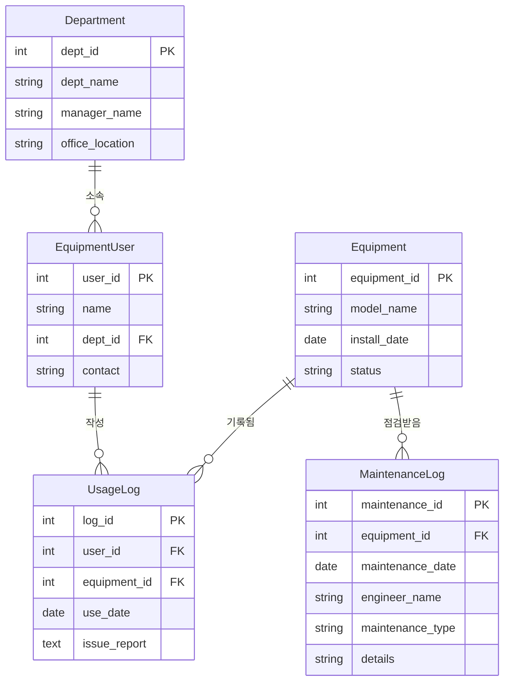

지금까지 우리는 `Equipment`, `EquipmentUser`, `UsageLog` 3개 테이블로 SemiconDB를 운영했습니다. 이번에는 **실제 현업처럼** 구조를 확장해 보겠습니다. 부서 정보를 별도 테이블로 분리하고(`Department`), 유지보수 이력을 관리하는 `MaintenanceLog`를 추가합니다.

---

## 1. SemiconDB v2: 왜 확장이 필요한가?

**기존 v1의 한계:**
- `EquipmentUser.department`에 부서명을 직접 저장 → 부서 이름이 바뀌면 모든 행을 UPDATE해야 함
- 유지보수 이력이 없어 장비 상태 변화를 추적할 수 없음

**v2 개선 사항:**
1. `Department` 테이블 분리 (부서 정보 정규화)
2. `EquipmentUser`의 `department` → `dept_id` (FK)로 변경
3. `MaintenanceLog` 추가 (엔지니어별 유지보수 이력)

---

## 2. SemiconDB v2 ERD



---

## 3. SemiconDB v2 구축

### 3.1 Department 테이블 생성

```sql
CREATE TABLE Department (
    dept_id         INT PRIMARY KEY,
    dept_name       VARCHAR(30) NOT NULL,
    manager_name    VARCHAR(20),
    office_location VARCHAR(50)
);

INSERT INTO Department VALUES
(1, '공정운영팀', '김현우', 'A동 1층'),
(2, '품질분석팀', '이서연', 'B동 2층'),
(3, '유지보수팀', '박정민', '장비동 1층');
```

### 3.2 EquipmentUser 리팩토링 (dept_id FK 추가)

```sql
CREATE TABLE EquipmentUser (
    user_id  INT PRIMARY KEY,
    name     VARCHAR(20) NOT NULL,
    dept_id  INT,  -- 'department' 문자열 대신 FK 사용
    contact  VARCHAR(50),
    FOREIGN KEY (dept_id) REFERENCES Department(dept_id)
);

INSERT INTO EquipmentUser VALUES
(1, '김현우', 1, '010-1111-1111'),  -- 공정운영팀
(2, '최민석', 1, '010-1111-2222'),
(3, '정다은', 1, '010-1111-3333'),
(4, '이서연', 2, '010-2222-1111'),  -- 품질분석팀
(5, '한지훈', 2, '010-2222-2222'),
(6, '박정민', 3, '010-3333-1111'),  -- 유지보수팀
(7, '오지훈', 3, '010-3333-2222'),
(8, '윤가은', 3, '010-3333-3333');
```

### 3.3 Equipment 데이터 (v2)

```sql
INSERT INTO Equipment VALUES
(101, 'ETCH-A100',   '2022-03-15', 'active'),
(102, 'CVD-B200',    '2021-11-20', 'maintenance'),
(103, 'LITHO-C300',  '2020-07-05', 'active'),
(104, 'CMP-D400',    '2022-09-12', 'inactive'),
(105, 'INSPECT-E500','2023-01-18', 'active');
```

### 3.4 MaintenanceLog 테이블 생성 및 데이터 입력

```sql
CREATE TABLE MaintenanceLog (
    maintenance_id   INT PRIMARY KEY,
    equipment_id     INT NOT NULL,
    maintenance_date DATE NOT NULL,
    engineer_name    VARCHAR(50) NOT NULL,
    maintenance_type VARCHAR(30) NOT NULL,
    details          VARCHAR(255),
    FOREIGN KEY (equipment_id) REFERENCES Equipment(equipment_id)
);

INSERT INTO MaintenanceLog VALUES
(1, 105, '2024-03-01', '윤가은', '정기점검',  '검사 센서 및 카메라 모듈 상태 점검'),
(2, 101, '2024-03-02', '박정민', '정기점검',  '식각 챔버 내부 청소 및 센서 점검'),
(3, 103, '2024-03-03', '윤가은', '정기점검',  '노광 정렬 장치 캘리브레이션 수행'),
(4, 102, '2024-03-06', '오지훈', '긴급수리',  '압력 제어 밸브 이상으로 장비 점검 시작'),
(5, 101, '2024-03-07', '박정민', '점검',       '식각 균일도 편차 원인 확인 및 공정 조건 점검'),
(6, 105, '2024-03-08', '윤가은', '점검',       '이상 패턴 재검토 및 검사 모듈 보정'),
(7, 104, '2024-03-09', '박정민', '고장수리',   '연마 패드 구동 이상으로 핵심 부품 교체'),
(8, 102, '2024-03-10', '오지훈', '정기점검',  '수리 후 재가동 전 안전 점검 진행'),
(9, 103, '2024-03-12', '윤가은', '점검',       '노광 정렬 오차 재점검 및 보정값 조정');
```

---

## 4. 4테이블 JOIN 실전

### 4.1 부서별 장비 사용 현황

```sql
-- 사용자 이름, 부서명, 사용 장비 모델명, 사용일을 함께 조회
SELECT 
    d.dept_name AS 부서,
    eu.name AS 사용자,
    e.model_name AS 장비모델명,
    u.use_date AS 사용일,
    u.issue_report AS 이슈내용
FROM UsageLog AS u
JOIN EquipmentUser AS eu ON u.user_id = eu.user_id
JOIN Department    AS d  ON eu.dept_id = d.dept_id
JOIN Equipment     AS e  ON u.equipment_id = e.equipment_id
ORDER BY d.dept_name, u.use_date;
```

### 4.2 유지보수 기록과 장비 정보

```sql
-- 유지보수 일자, 장비 모델명, 담당 엔지니어 이름 조회
SELECT 
    ml.maintenance_date AS 점검일,
    e.model_name AS 장비명,
    ml.engineer_name AS 엔지니어,
    ml.maintenance_type AS 점검유형,
    ml.details AS 상세내용
FROM MaintenanceLog AS ml
JOIN Equipment AS e ON ml.equipment_id = e.equipment_id
ORDER BY ml.maintenance_date;
```

### 4.3 엔지니어별 유지보수 건수

```sql
SELECT 
    ml.engineer_name AS 엔지니어,
    COUNT(*) AS 총유지보수건수,
    COUNT(CASE WHEN ml.maintenance_type = '긴급수리' THEN 1 END) AS 긴급수리건수,
    COUNT(CASE WHEN ml.maintenance_type = '정기점검' THEN 1 END) AS 정기점검건수,
    MAX(ml.maintenance_date) AS 최근점검일
FROM MaintenanceLog AS ml
JOIN Equipment AS e ON ml.equipment_id = e.equipment_id
GROUP BY ml.engineer_name
ORDER BY 총유지보수건수 DESC;
```

### 4.4 유지보수가 한 번도 없는 장비 찾기

```sql
SELECT e.model_name, e.status
FROM Equipment AS e
LEFT JOIN MaintenanceLog AS ml ON ml.equipment_id = e.equipment_id
WHERE ml.maintenance_id IS NULL;
```

---

## 5. 데이터 읽기 훈련: "맥락을 읽는 SQL"

SQL은 단순히 데이터를 꺼내오는 도구가 아닙니다. **데이터의 맥락을 읽고 의미있는 인사이트를 도출**하는 것이 진짜 능력입니다.

### 문제 풀기 전 체크리스트

```
1. 정보의 주체 찾기 → 어느 테이블을 봐야 하나?
2. "어떤" 주체? → 조건인가, 그룹인가, 집계인가, JOIN인가?
3. 주체의 무엇(정보)을 출력해야 하는가?
4. 현재 가진 데이터로 알 수 있는 정보인가?
```

---

### 훈련 1: 이상 보고된 장비가 유지보수로 이어졌는가?

**질문**: `UsageLog`에 이슈가 보고된 장비 중, 그 이후 `MaintenanceLog`에 기록이 있는가?

```sql
-- 이슈 보고 날짜와 가장 가까운 유지보수 날짜를 함께 조회
SELECT 
    e.model_name AS 장비명,
    u.use_date AS 이슈보고일,
    u.issue_report AS 이슈내용,
    MIN(ml.maintenance_date) AS 첫유지보수일,
    DATEDIFF(MIN(ml.maintenance_date), u.use_date) AS 경과일수
FROM UsageLog AS u
JOIN Equipment AS e ON u.equipment_id = e.equipment_id
LEFT JOIN MaintenanceLog AS ml 
    ON ml.equipment_id = u.equipment_id 
    AND ml.maintenance_date >= u.use_date  -- 이슈 보고 이후 유지보수만
WHERE u.issue_report IS NOT NULL
GROUP BY e.model_name, u.use_date, u.issue_report
ORDER BY u.use_date;
```

---

### 훈련 2: 현재 'maintenance' 상태인 장비는 왜 점검 중인가?

**질문**: `Equipment.status = 'maintenance'`인 장비의 가장 최근 유지보수 내용을 확인하라.

```sql
-- 주체: Equipment (status = 'maintenance')
-- 추가정보: MaintenanceLog (최근 내용)
SELECT 
    e.model_name AS 장비명,
    e.status AS 현재상태,
    ml.maintenance_date AS 점검일,
    ml.maintenance_type AS 점검유형,
    ml.details AS 상세내용,
    ml.engineer_name AS 담당엔지니어
FROM Equipment AS e
LEFT JOIN MaintenanceLog AS ml ON ml.equipment_id = e.equipment_id
WHERE e.status = 'maintenance'
ORDER BY ml.maintenance_date DESC;
```

---

### 훈련 3: 부서별 장비 사용 패턴 분석

**질문**: 공정운영팀과 품질분석팀은 각각 어떤 장비를 주로 사용하는가?

```sql
-- 부서별 장비 사용 횟수
SELECT 
    d.dept_name AS 부서,
    e.model_name AS 장비명,
    COUNT(u.log_id) AS 사용횟수,
    COUNT(u.issue_report) AS 이슈건수
FROM UsageLog AS u
JOIN EquipmentUser AS eu ON u.user_id = eu.user_id
JOIN Department    AS d  ON eu.dept_id = d.dept_id
JOIN Equipment     AS e  ON u.equipment_id = e.equipment_id
GROUP BY d.dept_name, e.model_name
ORDER BY d.dept_name, 사용횟수 DESC;
```

---

### 훈련 4: 한 장비의 타임라인 재구성

**질문**: 장비 101(ETCH-A100)에서 발생한 모든 이벤트를 시간 순으로 정리하라.

```sql
-- 사용 기록과 유지보수 기록을 UNION으로 합치기
SELECT 
    '사용' AS 이벤트유형,
    u.use_date AS 날짜,
    eu.name AS 관련자,
    COALESCE(u.issue_report, '정상') AS 내용
FROM UsageLog AS u
JOIN EquipmentUser AS eu ON u.user_id = eu.user_id
WHERE u.equipment_id = 101

UNION ALL

SELECT 
    '유지보수' AS 이벤트유형,
    ml.maintenance_date AS 날짜,
    ml.engineer_name AS 관련자,
    CONCAT('[', ml.maintenance_type, '] ', ml.details) AS 내용
FROM MaintenanceLog AS ml
WHERE ml.equipment_id = 101

ORDER BY 날짜, 이벤트유형;
```

> [!NOTE]
> `COALESCE(값1, 값2)`: 값1이 NULL이면 값2를 반환합니다.
> `CONCAT(str1, str2)`: 문자열을 이어 붙입니다.
> `UNION ALL`: 두 SELECT 결과를 합칩니다 (중복 포함).

---

### 훈련 5: 유지보수팀 업무 집중도 분석

**질문**: 특정 엔지니어에게 업무가 집중되어 있는가?

```sql
SELECT 
    ml.engineer_name AS 엔지니어,
    COUNT(*) AS 총건수,
    COUNT(CASE WHEN maintenance_type LIKE '%수리%' THEN 1 END) AS 수리건수,
    COUNT(CASE WHEN maintenance_type = '정기점검' THEN 1 END) AS 정기점검건수,
    ROUND(COUNT(*) * 100.0 / SUM(COUNT(*)) OVER(), 1) AS 비율_퍼센트
FROM MaintenanceLog AS ml
GROUP BY ml.engineer_name
ORDER BY 총건수 DESC;
```

---

## 6. 핵심 정리

| 개념 | 설명 |
|------|------|
| **DB 정규화** | 중복을 줄이고 데이터를 분리하여 독립적으로 관리 |
| **4테이블 JOIN** | UsageLog ↔ EquipmentUser ↔ Department ↔ Equipment |
| **UNION ALL** | 두 쿼리 결과를 하나로 합치기 (같은 컬럼 수/타입 필요) |
| **COALESCE** | NULL 대체값 지정 |
| **CASE WHEN** | 조건별 집계 (피벗 테이블 역할) |
| **DATEDIFF** | 두 날짜 간의 일수 차이 계산 |

다음이자 마지막 강에서는 반도체 공정 센서 데이터를 다루는 **ProcessSensorDB**를 통해 복잡한 6테이블 JOIN과 이상값 탐지 쿼리를 실습합니다.
